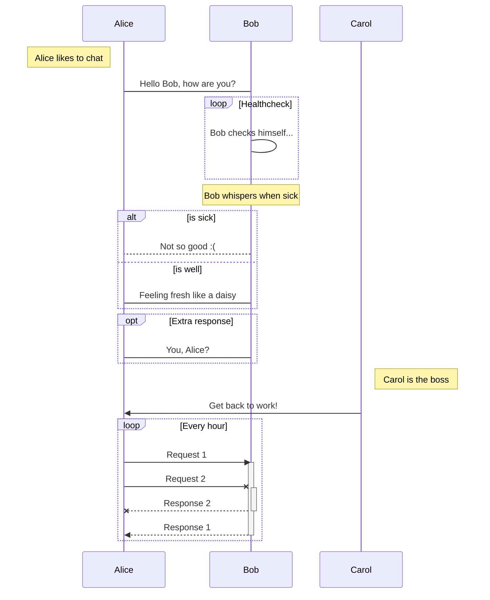

# Mermaid (for Sublime)

> :tropical_fish: The missing [Sublime Text 3][] package for [Mermaid][].

[Install Mermaid][] from [Package Control][].

- [x] [Flow diagram][] support, with caveats:
  - Inline node definition isn't supported, plus it does not scale well.
  - `style` isn't supported, since `class` (CSS) support is easier.


```mermaid
graph TB %% tab completion: 'graph'
  ID-1[Node 1] %% tab completion: 'node'
  ID-2>Node 2]
  ID-3(Node 3)
  ID-1---ID-2 %% tab completion: 'link'
  ID-1 --> ID-3
  ID-2--Link between 2 and 3---ID-3
  ID-3-->|Action from 3 to 1|ID-1
  ID-3 -- "Action from 3 to 2. p/w: '_-!#$%^&*+=?,\'" --> ID-2
  %% tab completion: 'class'
  classDef blue fill:#08f,stroke:#fff
  class ID-1 blue
  %% tab completion: 'click'
  click ID-1 "https://github.com" "Tooltip text"
  click ID-2 alert "Tooltip for a callback"
  subgraph A subgraph
    ID-4{Node 4}
    ID-5((fa:fa-spinner))
    ID-6["Node 6 (same #quot;shape#quot;)"]
    ID-4-.->ID-5
    ID-5 -. Action from 5 to 4 .-> ID-4
    ID-5==>ID-6
    ID-6 == Action from 6 to 5 ==> ID-5
  end %% tab completion: 'subgraph'
```

- [x] [Sequence diagram][] support




- [x] Preview in browser
  - From the Command Palette: `Mermaid: View In Browser`
  - Defaults to the entire file, unless there is a selection.
  - Configurable settings: `quiet_graph_links`, `theme`.

- [x] Exporting, with caveats:
  - PNG conversion from SVG conflicts with opening file-URL's, so it's a link.
  - Converted SVG may be missing some styling.

- [ ] Gantt diagram support
- [ ] Windows support
- [ ] Linux support

[Sublime Text 3]: http://www.sublimetext.com
[Mermaid]: http://knsv.github.io/mermaid
[Flow diagram]: https://mermaidjs.github.io/flowchart.html
[Sequence diagram]: https://mermaidjs.github.io/sequenceDiagram.html
[Install Mermaid]: https://packagecontrol.io/packages/Mermaid
[Package Control]: https://packagecontrol.io

---

Development:

```sh
# Remove package.
$ my_project_path=~/Projects/sublime-mermaid
$ my_packages_path=~/Library/Application\ Support/Sublime\ Text\ 3/Packages
$ ln -s "$my_project_path" "$my_packages_path/Mermaid"
$ cp "$my_project_path/tests/syntax_test_mermaid.mermaid" "$my_packages_path/Default"
# Develop...
$ rm "$my_packages_path/Default/syntax_test_mermaid.mermaid"
$ rm "$my_packages_path/Mermaid"
# Install package.
```
